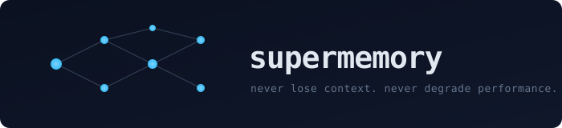

<p align="center">
  
</p>

<p align="center">
  <a href="LICENSE"></a>
  
  
</p>

<p align="center">
  Persistent, lazy-loaded knowledge graph for Claude Code. Auto-writes session summaries to Obsidian. Lets parallel Claude sessions see each other in real time. Costs pennies. Installs in one command.
</p>

---

## Why this exists

Claude Code sessions are stateless. You close the terminal and the context is gone. The next session you paste "what we did last time" or re-explain everything.

The native fixes do not solve this:

* `/resume` reloads a single past transcript but burns thousands of tokens to do it.
* The built in idle recap is a one liner, in memory, ephemeral.
* Stuffing context into `~/.claude/CLAUDE.md` works but inflates the eager load on every future session.

supermemory builds an external graph in your Obsidian vault. Past sessions become wiki pages. New sessions read 500 to 1000 bytes of breadcrumbs and traverse the graph on demand. The graph compounds across sessions, the eager load stays small.

## The three pillars

### 1. Past sessions, auto summarized

Three triggers spawn a headless `claude` call with **Haiku 4.5** that reads the just finished `.jsonl` transcript:

| Trigger | When it fires |
|---|---|
| `SessionEnd` | Session terminates (clear, resume, logout) |
| `PreCompact` | Just before context compaction |
| `/snapshot` | Manual mid session checkpoint |

The summarizer writes four things:

1. `SuperMemory/YYYY-MM-DD_<slug>_raw.md` -- the verbatim turn dump, tool calls collapsed to one line.
2. `SuperMemory/YYYY-MM-DD_<slug>.md` -- a structured summary (what happened, decisions, files changed, next session context).
3. One line appended to `SuperMemory/Index.md`.
4. One bullet appended to each entity hub the session touched (`Projects/X.md`, `People/Y.md`, etc.).

**Append only invariant.** The summarizer never reads prior wiki or SuperMemory content. It only appends. This is the token discipline that keeps the system cheap as the vault grows.

### 2. Live cross session visibility

Each running session writes `~/.claude/peers/<id>.json` (cwd, last prompt, files being edited, started_at, last_active). Three cheap bash hooks keep it current.

Any Claude can run **`/peers`** to see what other Claude sessions are doing right now. Useful when you run multiple `claude` instances in different tmux panes and want them to coordinate.

### 3. Minimum eager load

`SessionStart` injects roughly 500 to 1000 bytes of `additionalContext`:

* Last 2 session one liners from `Index.md`
* The project hub matching your `cwd` (one line summary)
* Active peer sessions (one line each)
* A breadcrumb telling Claude to lazy load via wikilinks, not pre fetch

No bulk dump. No 10 KB of "recent history" pasted into every prompt.

## Vault layout

```
~/Documents/Obsidian Vault/
├── Home.md
├── index.md               wiki catalog
├── log.md                 chronological ops log
├── SuperMemory/           session chronicle
│   ├── Index.md
│   ├── 2026-05-24_supermemory-build.md
│   └── 2026-05-24_supermemory-build_raw.md
├── Projects/              hub pages (one per project)
├── People/                hub pages (one per person)
├── Concepts/              domain concepts
├── Work/Tickets/          per ticket hubs
├── Playbooks/             step by step guides
├── Feedback/              behavior corrections
├── Templates/             page templates the summarizer reads
└── Archive/               rotated sessions over 30 days old
```

Wikilinks `[[Page]]` connect everything. Open the vault in [Obsidian](https://obsidian.md) and the graph view shows the entire knowledge structure.

## Requirements

* [Claude Code](https://www.anthropic.com/claude-code) CLI (`claude` on `$PATH`)
* `jq` (`brew install jq` or `apt install jq`)
* `lockf` (macOS, built in) or `flock` (Linux, built in). Optional but recommended.
* Obsidian (optional, for browsing)

## Install

```bash
git clone https://github.com/sahil7992/supermemory.git
cd supermemory
bash install.sh
```

For a custom vault path:

```bash
bash install.sh "/path/to/your/Obsidian Vault"
```

Add this to `~/.zshrc` so future sessions know:

```bash
export SUPERMEMORY_VAULT_DIR="/path/to/your/Obsidian Vault"
```

Restart Claude Code so the hooks load.

### First run (recommended)

If you have been using Claude Code without supermemory and want to backfill:

```bash
bash scripts/revive-wiki.sh   # scaffolds hubs from existing ~/.claude memory files
bash scripts/backfill.sh      # summarizes recent .jsonl transcripts
```

## Slash commands

| Command | What it does |
|---|---|
| `/snapshot` | Capture the current session to SuperMemory now (mid-session checkpoint) |
| `/peers` | Show what other running Claude sessions are doing right now |

## Hooks installed

| Event | Script | Purpose | Async |
|---|---|---|---|
| `SessionStart` | `on-session-start.sh` | Inject breadcrumbs, register self in peer registry | No (5s) |
| `UserPromptSubmit` | `on-prompt.sh` | Update peer registry with last prompt | Yes |
| `PreToolUse(Edit\|Write)` | `on-edit.sh` | Track files being edited for peer visibility | Yes |
| `PreCompact` | `on-summarize.sh` | Snapshot before context compaction | Yes |
| `SessionEnd` | `on-session-end.sh` | Remove peer entry, trigger final summarization | Yes |

Hooks return immediately. The summarizer runs detached as a background `claude -p` call.

## Maintenance

```bash
bash scripts/lint.sh         # dead wikilinks, orphan pages, stale hubs
bash scripts/rotate.sh       # move sessions over 30 days into Archive/
bash scripts/backfill.sh     # catch up after a long offline period
```

## Uninstall

```bash
bash uninstall.sh
```

Removes hooks, slash commands, and strips entries from `~/.claude/settings.json`. Your vault content stays intact.

## Architecture

See [docs/ARCHITECTURE.md](docs/ARCHITECTURE.md) for the design rationale, the append only invariant, the peer registry protocol, the token budget math, and failure modes.

## Cost

Per session at typical use:

| Component | Cost |
|---|---|
| Bash hooks (SessionStart, peers, etc.) | $0.00, sub millisecond |
| Headless Haiku 4.5 summarizer | $0.005 to $0.02 per session, runs in background |
| SessionStart injection | ~500 to 1000 bytes per session start |

A heavy day with 10 sessions: roughly 5 to 20 cents in Haiku spend.

## FAQ

**Will my settings get clobbered?**
No. `install.sh` merges hook entries into `~/.claude/settings.json` using `jq`. Existing hooks are preserved.

**What if jq or claude CLI is missing?**
`install.sh` warns and exits if `jq` is missing. Hooks degrade gracefully if `claude` is missing at runtime (summaries skip, peers still work).

**Does the summarizer ever read past sessions?**
No. The summarizer only reads the current session's `.jsonl`. It appends to `Index.md`, `log.md`, and entity hubs without reading their existing content. This is the append only invariant.

**Can I use a different model?**
Edit `hooks/on-summarize.sh` and change `--model claude-haiku-4-5`. Any Claude model works. Haiku is the cheap default.

**What if multiple sessions write Index.md at the same time?**
Hooks use `lockf` on macOS or `flock` on Linux for atomic appends. No race conditions.

**Where do logs go?**
`$SUPERMEMORY_VAULT_DIR/.logs/YYYYMMDD.log` for hook output, `YYYYMMDD-summarizer.log` for headless Haiku output.

**Does `/snapshot` collide with the built in Claude Code recap?**
No. Claude Code's built in recap is the passive one liner that fires when your terminal idles for 3 minutes -- it is not a slash command. `/snapshot` is a separate, explicit, on demand checkpoint that writes structured summaries to your vault.

## Repo layout

```
supermemory/
├── README.md
├── LICENSE
├── install.sh
├── uninstall.sh
├── assets/logo.svg
├── docs/
│   └── ARCHITECTURE.md
├── hooks/
│   ├── lib.sh
│   ├── on-session-start.sh
│   ├── on-summarize.sh
│   ├── on-prompt.sh
│   ├── on-edit.sh
│   └── on-session-end.sh
├── prompts/
│   └── summarizer.md
├── commands/
│   ├── snapshot.md
│   └── peers.md
├── templates/
│   ├── session.md
│   ├── project-hub.md
│   ├── person-hub.md
│   ├── concept-hub.md
│   └── ticket-hub.md
└── scripts/
    ├── revive-wiki.sh
    ├── backfill.sh
    ├── lint.sh
    └── rotate.sh
```

## License

[MIT](LICENSE).
